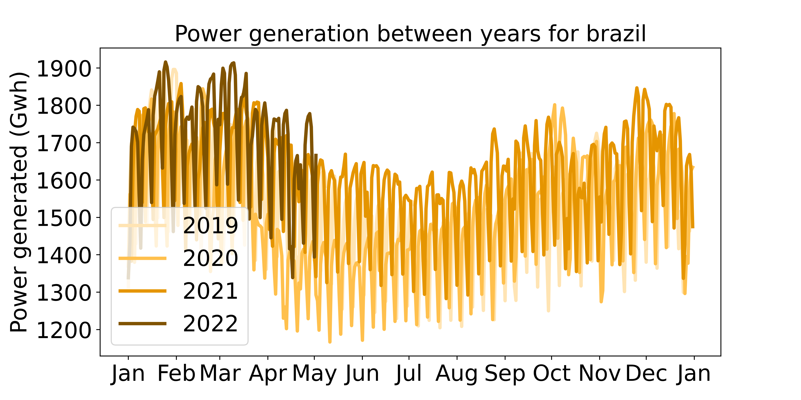

# GlobalPowerUpdate-Kow

[Brazil](./data/s_america/brazil)

**iea数据貌似是每月更新15号更新3个月前的数据**
https://www.iea.org/data-and-statistics/data-product/monthly-electricity-statistics

**India #必须翻墙**
完全更新完 数据会保持在每日更新 2天延迟

**Brazil**
完全更新完 数据会保持在每日更新 2天延迟

**US #必须翻墙**
完全更新完 数据会保持在每日更新 2天延迟

**EU #半小时运行一次 太慢**
完全更新完 数据会保持在每日更新 1天延迟

**Japan**
等爬虫 自己尝试过 失败了 每月月初10号左右更新2个月前的数据
现在更新到2021年1月31
日本公司 新代码

**Russia**
爬虫一直retry

**China**
火电没分开
