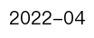
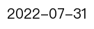
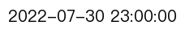
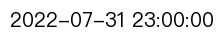
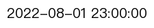
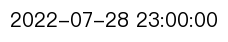

# 数据情况
### 分能源
|Fossil|Fossil|Fossil|Nuclear|Renewables|Renewables|Renewables|Renewables|
|:-:|:-:|:-:|:-:|:-:|:-:|:-:|:-:|
|**[`Coal`](./image/Coal_generation_for_all_country.svg)**|**[`Gas`](./image/Gas_generation_for_all_country.svg)**|**[`Oil`](./image/Oil_generation_for_all_country.svg)**|**[`Nuclear`](./image/Nuclear_generation_for_all_country.svg)**|**[`Hydro`](./image/Hydro_generation_for_all_country.svg)**|**[`Solar`](./image/Solar_generation_for_all_country.svg)**|**[`Wind`](./image/Wind_generation_for_all_country.svg)**|**[`Other`](./image/Other_generation_for_all_country.svg)**|
### 所有能源

### Other_Database
|Name|Source|Lastest_Date|Resolution|Description|Author|
|:-:|:-:|:-:|:-:|:-:|:-:|
|**[iea](./data/#global_rf/iea)**|**[monthly-electricity-statistics](https://www.iea.org/data-and-statistics/data-product/monthly-electricity-statistics)**||`Monthly`|15号更新 3月前数据|**[`Biqing`](https://github.com/cadagno)** **[`Kow`](https://github.com/KowComical)**|
|**[bp](./data/#global_rf/bp)**|**[Statistical Review of World Energys](https://www.bp.com/en/global/corporate/energy-economics/statistical-review-of-world-energy.html)**||`Yearly`|bp年度数据|**[`Biqing`](https://github.com/cadagno)** **[`Kow`](https://github.com/KowComical)**|
### Asian
|Name|Source|Lastest_Date|Resolution|Description|Author|
|:-:|:-:|:-:|:-:|:-:|:-:|
|**[China](./data/asia/china)**|**[中国电力企业联合会](https://cec.org.cn/menu/index.html?170)**||`Daily`|未来会继续完善爬虫|**[`Biqing`](https://github.com/cadagno)** **[`Zhu_Deng`](https://github.com/thuzhu)** **[`Kow`](https://github.com/KowComical)**|
|**[India](./data/asia/india)**|**[POSOCO](https://posoco.in/reports/daily-reports/)**||`Daily`|1天延迟|**[`Biqing`](https://github.com/cadagno)** **[`Zhu_Deng`](https://github.com/thuzhu)** **[`Kow`](https://github.com/KowComical)**|
|**[Japan](./data/asia/japan)**|**[OCCTO](https://occtonet3.occto.or.jp/public/dfw/RP11/OCCTO/SD/LOGIN_login#)**||`Hourly`|10号更新 2月前数据 用公司新数据拆分的火电|**[`Biqing`](https://github.com/cadagno)** **[`Zhu_Deng`](https://github.com/thuzhu)** **[`Kow`](https://github.com/KowComical)**|
|**[Turkey](https://github.com/KowComical/GlobalPowerUpdate-Kow/issues/27)**||||已有源数据 还未更新||

### Africa
|Name|Source|Lastest_Date|Resolution|Description|Author|
|:-:|:-:|:-:|:-:|:-:|:-:|
|**[South Africa](./data/africa/south_africa)**|**[Eskom](https://www.eskom.co.za/dataportal/supply-side/station-build-up-for-the-last-7-days/)**||`Hourly`|24小时延迟|**[`Biqing`](https://github.com/cadagno)** **[`Kow`](https://github.com/KowComical)**|
|**[Nigeria](https://github.com/KowComical/GlobalPowerUpdate-Kow/issues/11)**||||还未更新||

### Europe
|Name|Source|Lastest_Date|Resolution|Description|Author|
|:-:|:-:|:-:|:-:|:-:|:-:|
|**[EU27&UK](./data/europe/eu27_uk)**|**[Entsoe](https://transparency.entsoe.eu/generation/r2/actualGenerationPerProductionType/show)** **[BMRS](https://www.bmreports.com/bmrs)**||`Hourly`|UK用的是BMRS数据 9小时延迟|**[`Biqing`](https://github.com/cadagno)** **[`Zhu_Deng`](https://github.com/thuzhu)** **[`Kow`](https://github.com/KowComical)**|
|**[Russia](./data/europe/russia)**|**[EMRES](https://emres.cn)**||`Hourly`|后续还要再修正拆分火电 Hourly 并不能正确反映太阳能数据|**[`Zhu_Deng`](https://github.com/thuzhu)** **[`Kow`](https://github.com/KowComical)**|
|**[Ukraine](https://github.com/KowComical/GlobalPowerUpdate-Kow/issues/23)** ||||还未更新||

### North_America
|Name|Source|Lastest_Date|Resolution|Description|Author|
|:-:|:-:|:-:|:-:|:-:|:-:|
|**[United States](./data/n_america/us)**|**[EIA](https://www.eia.gov/electricity/)**||`Hourly`|24小时左右延迟|**[`Biqing`](https://github.com/cadagno)** **[`Zhu_Deng`](https://github.com/thuzhu)** **[`Kow`](https://github.com/KowComical)**|

### Sorth_America
|Name|Source|Lastest_Date|Resolution|Description|Author|
|:-:|:-:|:-:|:-:|:-:|:-:|
|**[Brazil](./data/s_america/brazil)**|**[ONS](http://www.ons.org.br/Paginas/resultados-da-operacao/historico-da-operacao)**||`Hourly`|72小时左右延迟|**[`Biqing`](https://github.com/cadagno)** **[`Zhu_Deng`](https://github.com/thuzhu)** **[`Kow`](https://github.com/KowComical)**|

### Oceania
|Name|Source|Lastest_Date|Resolution|Description|Author|
|:-:|:-:|:-:|:-:|:-:|:-:|
|**[Austrlia](https://github.com/KowComical/GlobalPowerUpdate-Kow/issues/12)**||||还未更新||

### ROW
|Name|Source|Lastest_Date|Resolution|Description|Author|
|:-:|:-:|:-:|:-:|:-:|:-:|
|**[ROW](https://github.com/KowComical/GlobalPowerUpdate-Kow/issues/11)**||||还未更新||

