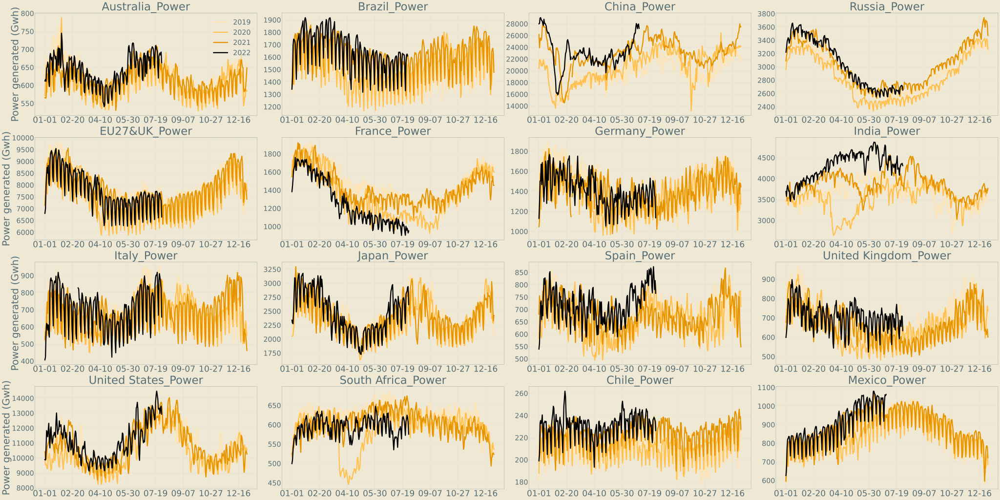

## 运行情况

## 数据情况
#### 分能源
| | | | | | | | |
|----|----|----|----|----|----|----|----|
|**[Coal](./image/Coal_generation_for_all_country.svg)**|**[Gas](./image/Gas_generation_for_all_country.svg)**|**[Oil](./image/Oil_generation_for_all_country.svg)**|**[Nuclear](./image/Nuclear_generation_for_all_country.svg)**|**[Hydro](./image/Hydro_generation_for_all_country.svg)**|**[Solar](./image/Solar_generation_for_all_country.svg)**|**[Wind](./image/Wind_generation_for_all_country.svg)**|**[Other](./image/Other_generation_for_all_country.svg)**

#### 所有能源

#### Monthly
- [x] **[iea](./data/#global_rf/iea)** 每月15号更新3个月前的数据
#### Daily
- [x] **[India](./data/asia/india)** 1天延迟
- [x] **[China](./data/asia/china)** 已实现全自动化 # 但有瑕疵 偶尔需要去网站自己找缺失的（爬虫没找到的）数据 未来会进一步完善爬虫
#### Hourly
- [x] **[Brazil](./data/s_america/brazil)** 72小时延迟 # 不是非常准时 有时延迟大有时小
- [x] **[United States](./data/n_america/us)** 24小时左右延迟
- [x] **[EU27&UK](./data/europe/eu27_uk)** 9小时延迟
- [x] **[Japan](./data/asia/japan)** 每月月初10号左右更新2个月前的数据 用日本公司新数据可拆分火电类型
- [x] **[Russia](./data/europe/russia)** 最后一个月数据是从bp simulated的 后续还要再修正拆分火电

## 待更新国家
- [ ] **[ROW](https://github.com/KowComical/GlobalPowerUpdate-Kow/issues/11)** 
- [ ] **[Austrlia](https://github.com/KowComical/GlobalPowerUpdate-Kow/issues/12)** 
- [ ] **[乌克兰](https://github.com/KowComical/GlobalPowerUpdate-Kow/issues/23)** 
- [ ] **[土耳其]**
- [ ] **[南非]**

